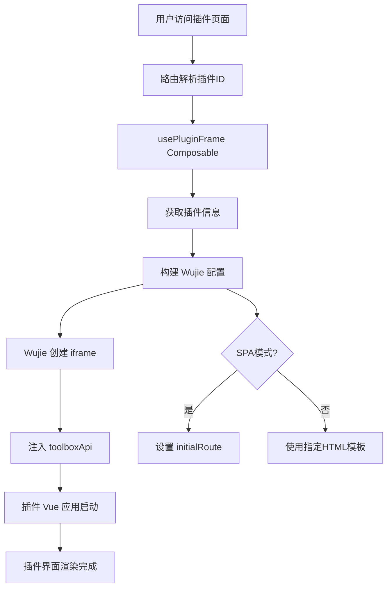
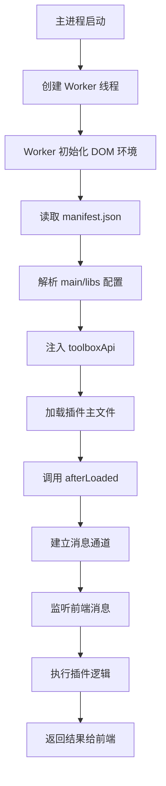

# 插件开发指南

ACLiveFrame 提供了强大的插件系统，支持开发者创建自定义功能。本指南介绍如何使用插件开发工具创建、开发和部署插件。

## 📚 目录

- [架构概览](#架构概览)
- [快速开始](#快速开始)
- [项目结构](#项目结构)
- [插件配置](#插件配置)
- [前端开发](#前端开发)
- [后端开发](#后端开发)
- [API 参考](#api-参考)
- [故障排除](#故障排除)
- [深入阅读](#深入阅读)

## 🏗️ 架构概览

ACLiveFrame 插件系统采用 **双进程模型 (Dual-Process Model)** 以确保稳定性和灵活性：

### 前端 (渲染进程 Renderer)
- 基于 **Vue 3 + Vite** 构建
- 运行在安全的沙箱环境中 (WebView 或 Wujie 微前端)
- 负责处理独立窗口 (Window)、侧边栏面板 (UI) 和直播画板 (Overlay) 的界面渲染
- 通过标准的 HTTP/WebSocket 或工具箱提供的 IPC 桥接器与后端通信

#### 前端承载原理

前端通过 **Wujie 微前端技术**实现插件的沙箱化承载，确保插件运行环境的隔离性和安全性。



**Wujie 微前端机制:**

1. **iframe 沙箱**
   ```javascript
   // Wujie 创建带沙箱的 iframe
   <WujieVue
     :name="wujieName"
     :url="pluginUrl"
     :props="wujieProps"
     :plugins="wujiePlugins"
     :sync="true"
     :alive="false"
   />
   ```

2. **API 注入**
   ```javascript
   // 通过 props 注入 toolboxApi
   wujieProps.value = {
     pluginId: id,
     version: info.version,
     toolboxApi: createPluginApi(apiContext),
     initialRoute: spa ? (conf.route || '/') : undefined
   }
   ```

3. **形态适配**
   - **Window**: `WindowFramePluginPage.vue` - 独立窗口，有标题栏和窗口控制
   - **UI**: `PluginFramePage.vue` - 嵌入式面板，适配宿主界面
   - **Overlay**: `OverlayFramePluginPage.vue` - 覆盖层，高性能渲染

4. **通信桥梁**
   ```javascript
   // 通过 Wujie bus 进行跨 iframe 通信
   const bus = (WujieVue as any)?.bus;
   bus?.$on?.('plugin-ready', handler);
   ```

**开发模式支持:**
- 自动检测开发服务器 (`buildPluginPageUrlWithDev`)
- 热重载 (HMR) 保持 iframe 同步
- 开发工具集成，便于调试

### 后端 (主进程 Main Process)
- 作为工具箱管理的 **Node.js** 子进程运行
- 入口点定义在 `src/main/index.ts`
- 拥有访问工具箱 API (系统、文件系统、AcFun API 等) 的完整权限
- 负责业务逻辑、数据持久化和繁重的计算任务

### 后端原理详解

插件后端基于 Worker 线程架构运行，提供了沙箱化的执行环境。

#### Worker 执行流程



#### 关键组件说明

**1. DOM 环境模拟 (happy-dom)**
```javascript
// 创建模拟的 window/document 环境
const dom = new Window({ url: 'http://localhost:8080', width: 1920, height: 1080 })
const windowRef = dom.window
global.window = windowRef
```

**2. toolboxApi 注入**
```javascript
// 通过 createMainPluginApi 创建 API 实例
const toolboxApi = createMainPluginApi(pluginId, version, apiBase)
windowRef.toolboxApi = toolboxApi
windowRef.api = toolboxApi // 兼容性别名
```

**3. 模块系统与安全**
```javascript
// 构建受限的 require 函数
const pluginRequire = (id) => {
  if (libRegistry[id]) return libRegistry[id]
  // 只允许访问 manifest.libs 中声明的模块
  throw new Error(`模块 "${id}" 未被允许`)
}
windowRef.require = pluginRequire
```

**4. 生命周期管理**
```javascript
// 插件加载完成后调用
if (typeof windowRef.afterLoaded === 'function') {
  await windowRef.afterLoaded(api)
}

// 进程退出时清理资源
process.on('exit', async () => {
  if (windowRef.cleanup) await windowRef.cleanup()
})
```

#### 消息通信机制

- **前端 → 后端**: 通过 `parentPort.postMessage` 发送消息
- **后端 → 前端**: 通过 SSE (Server-Sent Events) 或 IPC 推送更新
- **主进程 → Worker**: 直接调用 Worker 的执行方法

#### 何时需要后端

并非所有插件都需要后端逻辑。以下情况推荐使用后端：

| 场景 | 原因 | 示例 |
|------|------|------|
| **文件系统访问** | 需要读写本地文件或数据库 | 插件配置持久化、日志存储 |
| **网络请求绕过 CORS** | 调用外部 API 或内部服务 | AcFun 数据获取、第三方服务集成 |
| **长时间运行任务** | 避免前端页面崩溃影响 | 弹幕监听、定时任务 |
| **原生 Node.js 模块** | 使用 fs、child_process 等 | 系统命令执行、本地文件操作 |
| **高性能计算** | CPU 密集型任务 | 数据分析、图像处理 |
| **权限管理** | 需要系统级权限 | 硬件访问、系统设置 |

#### 后端开发最佳实践

**1. 错误处理**
```typescript
export async function handleMessage(event: string, payload: any) {
  try {
    // 业务逻辑
    return { success: true, data: result }
  } catch (error) {
    apiRef.logger.error('处理消息失败:', error)
    return { success: false, error: error.message }
  }
}
```

**2. 资源清理**
```typescript
const subscriptions: Map<string, () => void> = new Map()

export function cleanup() {
  // 清理所有订阅
  for (const closer of subscriptions.values()) {
    try { closer() } catch (e) {}
  }
  subscriptions.clear()
}
```

**3. 内存管理**
```typescript
// Worker 会自动监控内存使用
// 大对象及时释放，避免内存泄漏
setInterval(() => {
  // 定期清理缓存
  clearCache()
}, 300000) // 5分钟
```

### 清单系统 (The Manifest System)
插件通过 `manifest.json` 文件定义。在此 CLI 工具中，该清单文件由 `package.json` 中的 `pluginConfig` 字段**自动生成**。

## 🚀 快速开始

### 先决条件
- Node.js (推荐 v18+)
- pnpm (推荐) 或 npm

### 安装
克隆本模板并安装依赖：
```bash
pnpm install
```

### 开发命令

| 命令 | 说明 |
| :--- | :--- |
| `pnpm dev` | 启动开发服务器，支持 **热模块替换 (HMR)**。同时启动 Vite 和 TypeScript 监听器来监控前端和后端代码变更。 |
| `pnpm build` | 编译前端代码 (使用 Vite)，然后编译后端代码 (使用 TSC) 以供生产环境使用。 |
| `pnpm build:main` | 仅编译后端 TypeScript 代码到 `dist-main/` 目录。 |
| `pnpm package` | 将构建好的插件打包为 `.zip` 文件存放在 `release/` 目录中，可直接分发。 |
| `pnpm create <id>` | 在上级目录中根据此模板创建一个指定 ID 的新插件项目。 |
| `pnpm clean` | 清理构建产物目录 (`dist`, `dist-main`, `index.js`)。 |

## 📂 项目结构

```
plugin-cli/
├── scripts/             # 构建和 CLI 脚本
│   └── cli.mjs         # 主 CLI 工具
├── src/
│   ├── app/            # [前端] Vue 3 应用程序
│   │   ├── main.ts     # 前端入口点
│   │   ├── shell/      # 应用外壳组件
│   │   │   └── App.vue
│   │   └── views/      # 页面视图 (Window, UI, Overlay)
│   │       ├── OverlayView.vue
│   │       ├── UiView.vue
│   │       └── WindowView.vue
│   ├── env.d.ts        # 环境类型定义
│   ├── main/           # [后端] Node.js 插件逻辑
│   │   └── index.ts    # 后端入口点 (导出生命周期钩子)
│   └── types/          # TypeScript 类型定义
│       ├── danmu.d.ts      # 弹幕相关类型
│       ├── toolbox-api-main.d.ts # 主进程 API 类型
│       └── toolbox-api.d.ts      # 工具箱 API 类型
├── public/             # 静态资源目录
│   └── icon.svg        # 插件图标
├── release/            # 构建输出目录
├── package.json        # 插件配置 (pluginConfig)
├── tsconfig.json       # TypeScript 配置 (前端)
├── tsconfig.main.json  # TypeScript 配置 (后端)
├── vite.config.ts      # Vite 配置
└── index.html          # HTML 模板
```

## ⚙️ 配置指南 (`pluginConfig`)

在 `package.json` 的 `pluginConfig` 字段下配置您的插件。

```json
{
  "pluginConfig": {
    "spa": true,                    // 是否为单页应用 (SPA)，当为 true 时 html 字段无效
    "main": {                       // 后端入口配置
      "dir": ".",                   // 入口文件所在目录
      "file": "index.js",           // 入口文件名 (由 src/main/index.ts 编译而来)
      "libs": []                    // 依赖库 (可选)
    },
    "icon": "icon.svg",             // 插件图标路径 (相对于 public 目录)

    // 独立窗口配置
    "window": {
      "route": "/window",           // Vue 应用中的路由路径
      "width": 1024,                // 窗口宽度
      "height": 768,                // 窗口高度
      "minWidth": 400,              // 最小宽度
      "minHeight": 200,             // 最小高度
      "resizable": true,            // 是否可调整大小
      "html": "index.html"          // HTML 模板文件 (当 spa 为 true 时无效)
    },

    // OBS 直播画板 / 挂件配置
    "overlay": {
      "route": "/overlay",          // Vue 应用中的路由路径
      "html": "index.html"          // HTML 模板文件 (当 spa 为 true 时无效)
    },

    // 用户配置项 (显示在工具箱设置页面中)
    "config": {
      "config": {
        "type": "input",            // 配置类型: input, select, boolean, textarea, text, file, directory
        "label": "配置项",          // 显示标签
        "description": "这里可以输入插件的配置项，并在插件管理-查看详情-设置中统一管理，支持boolean、number、select、textarea、text、file、directory",
        "default": ""               // 默认值
      },
      "select_demo": {
        "type": "select",           // 下拉选择框
        "label": "选择示例",
        "description": "这是一个下拉选择框示例",
        "default": "option1",
        "options": [                // 选项列表
          {
            "label": "选项1",
            "value": "option1"
          },
          {
            "label": "选项2",
            "value": "option2"
          }
        ]
      }
    }
  }
}
```

## 🖥️ 后端开发

后端逻辑位于 `src/main/index.ts`。您必须导出特定的生命周期函数来与工具箱进行交互。

### 入口点示例 (`src/main/index.ts`)

```typescript
import type { ToolboxMainApi } from '../types/toolbox-api-main'

let apiRef: ToolboxMainApi | undefined
let startedAt: number | undefined

// 本地保存订阅的关闭函数，用于清理
const subscriptions: Map<string, () => void> = new Map()

export function afterLoaded(api: ToolboxMainApi) {
  apiRef = api
  startedAt = Date.now()
  api.logger.info('[插件] 已启动')

  // 监听来自前端的消息
  api.onUiMessage((payload: any) => {
    handleUiMessage(payload)
  })

  // 示例：监听配置变更
  api.settings.onChange((newConfig) => {
    api.logger.info('配置已更新:', newConfig)
  })
}

export function cleanup() {
  apiRef?.logger?.info('[插件] 正在清理...')

  // 清理所有订阅
  for (const closer of subscriptions.values()) {
    try { closer() } catch (e) {}
  }
  subscriptions.clear()

  apiRef = undefined
}

export function getStatus() {
  return {
    startedAt,
    running: !!apiRef
  }
}

export function onConfigUpdated(newConfig: unknown) {
  apiRef?.logger?.info(`[插件] 配置更新: ${JSON.stringify(newConfig)}`)
}

// 处理来自前端的消息和API调用示例（省略具体实现）
```

## 📖 API 参考

`ToolboxMainApi` 提供了访问宿主系统和 AcFun 服务的接口。完整的类型定义请参阅 `src/types/toolbox-api-main.d.ts`。

### 核心模块

#### 1. 订阅与事件流（单一 SSE 通道）
- 所有插件侧 SSE 订阅均通过统一通道 `GET /sse/plugins/:pluginId/overlay`，由注入的 `toolboxApi` 封装
- 订阅/取消订阅由主进程通过 `/api/plugins/:pluginId/subscribe` 管理
- 示例：监听消息、配置变更、只读store等

#### 2. `acfun` - AcFun 平台集成
访问用户信息、直播间信息、发送弹幕和礼物数据。

#### 3. `fs` - 文件系统
沙箱化的文件访问和持久化存储。

#### 4. `window` - 窗口控制
控制插件的独立窗口 (如果已配置)。

#### 5. `lifecycle` - 生命周期事件
监听应用程序事件。

#### 6. `logger` - 日志记录
将日志输出到主工具箱的日志文件中。

#### 7. `http` - 网络代理
通过主进程发起 HTTP 请求 (绕过 CORS 限制)。

#### 8. `store` - 共享状态
访问全局应用程序状态 (只读)。

## 🔧 故障排除

### 常见问题

**插件无法加载或运行？**
- 检查 `package.json` 中的 `pluginConfig` 配置是否正确
- 确保 `src/main/index.ts` 导出了必需的生命周期函数 (`afterLoaded`, `cleanup`)
- 查看工具箱的日志输出以获取详细错误信息

**前端页面无法正常显示？**
- 确认路由配置正确 (在 `pluginConfig` 中设置正确的 `route`)
- 检查 Vue 组件是否正确导入和注册
- 确保构建过程成功完成 (`pnpm build`)

**API 调用失败？**
- 验证 API 方法名称和参数格式
- 检查工具箱版本兼容性
- 查看 `src/types/toolbox-api.d.ts` 获取正确的类型定义

**热重载不工作？**
- 确保使用 `pnpm dev` 命令启动开发服务器
- 检查控制台是否有 TypeScript 编译错误
- 确认文件修改已保存

### 调试技巧
- 使用 `api.logger` 记录调试信息，这些日志会输出到工具箱的主日志文件中
- 在前端代码中使用 `console.log`，日志会显示在插件的开发者工具中
- 利用 `getStatus()` 函数返回插件的运行状态

## 📝 开发提示

- **类型安全**: 充分利用 TypeScript 类型定义，避免运行时错误
- **错误处理**: 在异步操作中添加适当的 try-catch 块
- **资源清理**: 在 `cleanup()` 函数中释放所有订阅和定时器
- **性能优化**: 避免频繁的 API 调用，合理使用缓存

## 📚 深入阅读

- **[插件 CLI 工具说明](../../plugin-cli/README.md)** - 完整的插件开发工具文档和详细示例
- **[API 参考](../../openspec/)** - OpenAPI 规范和详细的 API 文档

---

<div align="center">
  <p>准备好开始开发插件了吗？</p>
  <p>🚀 <a href="quickstart.md">返回快速开始</a> | 🏗️ <a href="architecture.md">了解项目架构</a></p>
</div>
